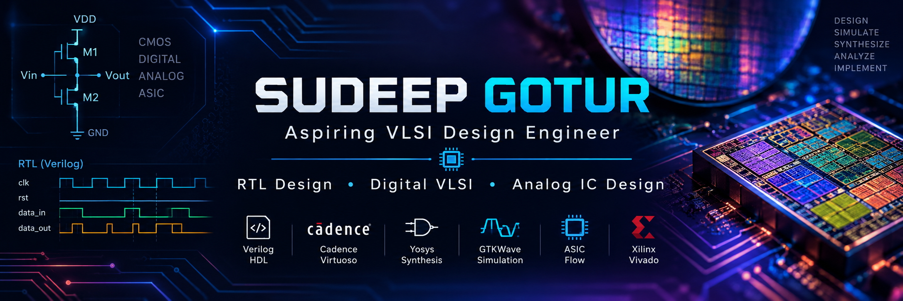

  

# Sudeep Gotur — Aspiring VLSI Design Engineer

**RTL Design • Digital VLSI • ASIC Design Flow • Analog IC Design**

---

## 👋 About Me

I am an Electronics and Communication Engineering student aspiring to
build a career as a **VLSI Design Engineer**, with a primary focus on
**Digital RTL Design and Analog IC Design**.

I am developing my skills through hands-on implementation of Verilog
designs, RTL simulation, logic synthesis, static timing analysis, and
ASIC design flow.

I believe in learning by designing, simulating, analyzing, and improving
actual hardware designs.

---

## 🎯 Technical Focus

### Digital VLSI & RTL

- Verilog HDL
- RTL Design
- Combinational & Sequential Logic
- FSM Design
- Arithmetic Circuits
- Digital IC Design
- RTL Simulation
- Logic Synthesis
- Static Timing Analysis
- ASIC Design Flow
- RTL-to-GDS Flow

### Analog VLSI

- CMOS Fundamentals
- CMOS Circuit Design
- Analog IC Design
- Analog VLSI Fundamentals
- Transistor-Level Circuit Concepts

### Embedded & Hardware

- ESP32 / Arduino
- Microcontroller Fundamentals
- Sensor Interfacing
- I²C
- Motor Control
- Embedded Hardware Design

---

## 🛠️ Tools & Technologies

### HDL & RTL

- Verilog HDL
- Icarus Verilog
- Verilator
- GTKWave

### ASIC & VLSI

- Yosys
- Static Timing Analysis
- ASIC Design Flow
- Timing Constraints
- NanGate 45nm Open Cell Library

### EDA & Engineering Tools

- Cadence Virtuoso
- Xilinx Vivado
- MATLAB
- EasyEDA
- Arduino IDE
- Falstad Circuit Simulator
- Wokwi

### Programming

- C
- C++
- Python

---

## 📚 Currently Learning & Applying

My current focus is **RTL-to-Synthesis and Static Timing Analysis**, with future progression toward **power analysis and physical design**.

I continuously apply what I learn through practical work with:

- Verilog RTL design
- RTL simulation
- Yosys synthesis
- Static Timing Analysis
- Timing constraints
- Technology libraries
- ASIC design flow
- Digital VLSI concepts
- Analog VLSI concepts

I am particularly interested in understanding how a design moves
from **RTL → Synthesis → Timing Analysis → Physical Implementation**.

---

## 🚀 Featured VLSI Projects

### 🔹 Verilog Practice

A growing collection of Verilog HDL practice covering digital design
concepts, RTL implementation, testbenches, simulation, synthesis,
and timing analysis.

**Focus:** Verilog • RTL • Simulation • Synthesis • STA

---

### 🔹 32-bit Array Multiplier — Cadence Virtuoso

Designed and functionally simulated a **32-bit array multiplier**
using Half Adders and Full Adders in Cadence Virtuoso.

**Focus:** Digital VLSI • Arithmetic Circuits • Cadence Virtuoso
• Schematic Design • Simulation

---

## 🤖 Embedded & Hardware Projects

My primary career focus is VLSI, while my embedded and robotics
projects provide additional hands-on hardware design experience.

### 🔹 SpruceBot — Automatic Dust-Collecting Robot

Autonomous dust-collecting robot using Arduino Mega, ESP8266,
ultrasonic sensors, IR sensors and DC motor control.

**Technologies:** Arduino • ESP8266 • Sensors • Motor Control

### 🔹 Body Posture Monitor

Real-time desk posture monitoring system using ESP32, MPU6050,
I²C LCD and vibration-based alerts.

**Technologies:** ESP32 • MPU6050 • I²C • Embedded Systems

### 🔹 Autonomous Line-Following Robot

Four-wheel autonomous robot using IR sensors for line detection
and motor control.

**Technologies:** Arduino • IR Sensors • DC Motors • Embedded Systems

---

## 🌱 Career Goal

My goal is to become an industry-ready **VLSI Design Engineer** with
strong foundations in:

- RTL / Digital Design
- ASIC Design
- Logic Synthesis
- Static Timing Analysis
- RTL-to-GDS Flow
- Digital VLSI
- Analog IC Design

I am actively looking for **VLSI internship and entry-level
opportunities**.

---

## 📊 GitHub

I use GitHub to document my learning, RTL implementations,
VLSI projects, experiments, and hardware projects.

I regularly update my repositories as I learn and apply new concepts.

---

## 📫 Connect With Me

**LinkedIn:** [Sudeep Gotur](https://www.linkedin.com/in/sudeep-gotur-66367435b/)

**GitHub:** [sudeepgotur](https://github.com/sudeepgotur)

---

### Building circuits. Writing RTL. Learning VLSI.

⭐ Thanks for visiting my profile!

